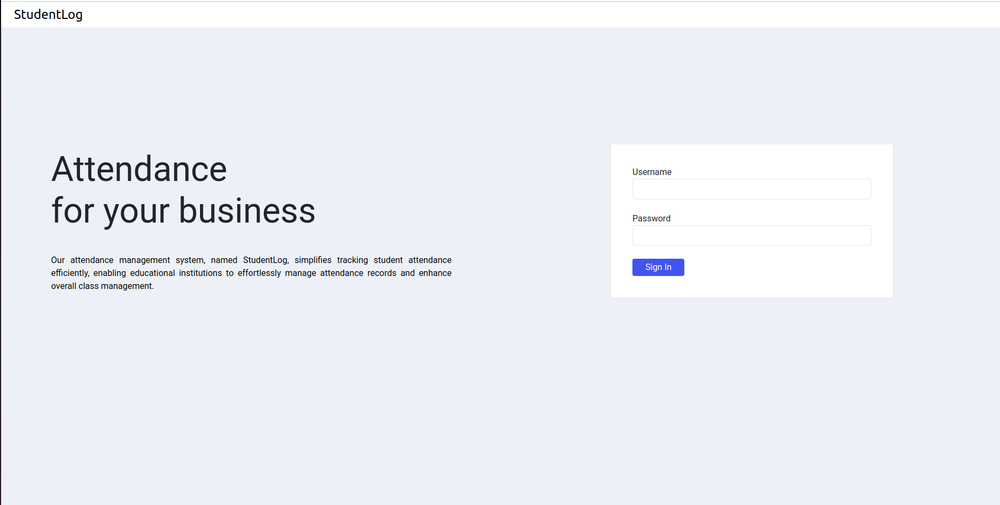
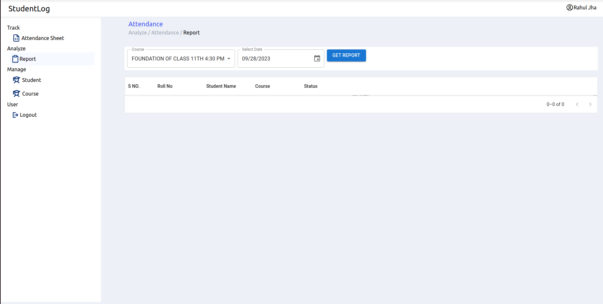
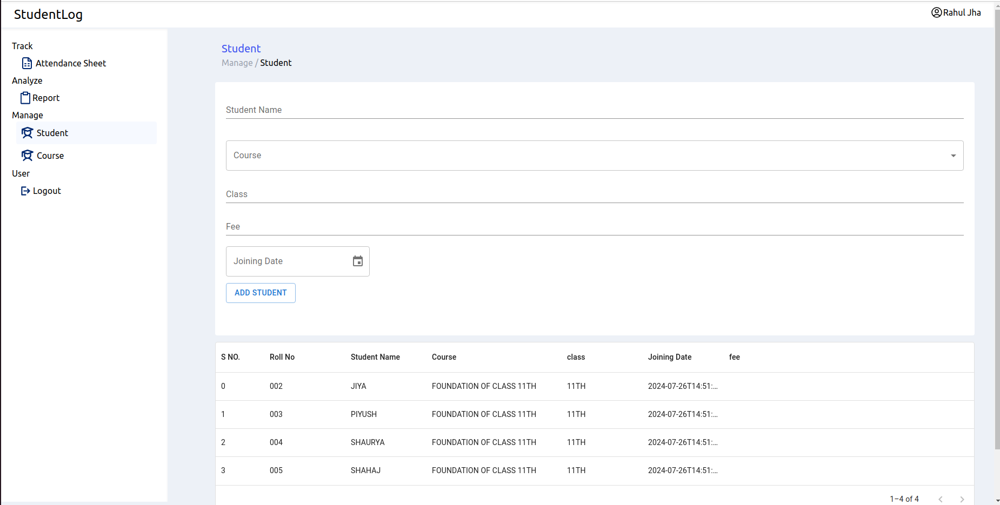
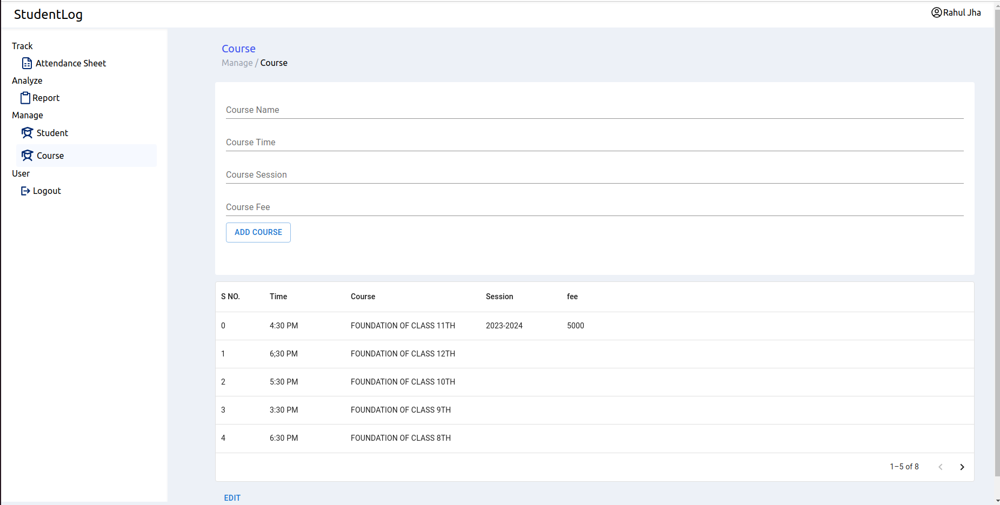
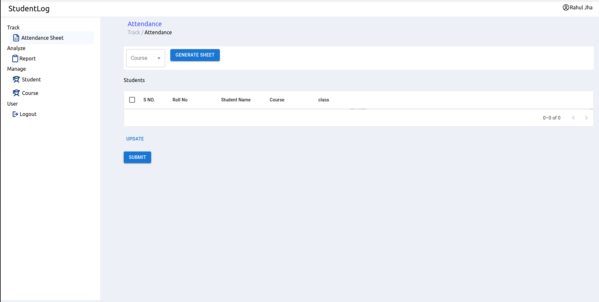

# Student Log



## Table of Contents

- [Project Description](#project-description)
- [Features](#features)
- [Technologies Used](#technologies-used)
- [Installation](#installation)
- [Usage](#usage)
- [Contributing](#contributing)
- [License](#license)
- [Contact](#contact)

## Project Description

Student Log is a comprehensive application designed to help educators and students manage academic records efficiently. It provides features for logging attendance, recording grades, and tracking student progress over time.

## Features

- **Attendance Tracking:** Easily mark attendance for each student.
- **Grade Management:** Record and view student grades.
- **Progress Reports:** Generate reports to track student progress.
- **User Roles:** Different roles for teachers and students, with appropriate permissions.
- **Responsive Design:** Works on both desktop and mobile devices.

## Technologies Used

- **Front-End:**
  - React.js
  - Tailwind CSS
  - TypeScript

- **Back-End:**
  - Node.js
  - Express

- **Database:**
  - MongoDB

- **Tools and Services:**
  - AWS
  - PM2
  - Stripe
  - Google Analytics

## Installation

1. **Clone the repository:**

   ```bash
   git clone https://github.com/manish8285/student-log.git
   cd student-log

2. **Install dependencies:**

    1. Go to frontend/student-log to install frontend dependencies
    ```bash 
    npm install  
    npm run dev

    2. install in root directory for backend 
    ```bash 
    npm install 
    npm run dev


3. **Install dependencies:** 
    Create a .env file in the root directory and add the necessary environment variables: 
    PORT = 8181  
    MONGO_URI ="your mongo db url string" 
    JWT_SECRET="your sceret" 

## Usage
**Login:** Use the provided credentials to log in as a teacher or student.   
 
**Dashboard:** Access the dashboard to manage attendance, grades, and reports.  

**Reports:** Generate and view progress reports for each student.   


## Snap Shot 



 
 



